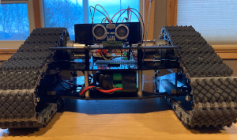

# jbot

This is a personal project with the following goals:

* practice ros2
* practice C++, especially rclcpp
* learn how to best integrate ros2 + [behaviortreecpp](https://www.behaviortree.dev/docs/3.8/intro)

## Hardware

Base:

* [Lynxmotion Tri-Track chassis](http://www.lynxmotion.com/c-120-no-electronics-kit.aspx) with two 12V DC motors
* [Robokits RKI-1004 Dual Motor Driver](docs/RKI-1004_motor_controller.pdf) (up to 5A)
* 12.0V 2200mAh NiMh battery pack, for powering motors

Electronics:

* Raspberry pi 4
* [HC-SR04 Ultrasonic distance sensor](docs/HCSR04.pdf)
* Skullcandy Stash Fuel 10000 mAh portable power bank (USB-C, 5V, 2.4A), for powering all electronics via RPi4

See [docs](docs) for more images and hardware info.

_See [Iohannes blog post](http://jessicaaustin.net/iohannes-a-robot-based-off-the-sparkfun-ioio/) for a previous iteration of this robot._

## Software

* [ros2 foxy](https://docs.ros.org/en/foxy/)
* [BehaviorTreeCpp v3](https://www.behaviortree.dev/docs/3.8/intro)
