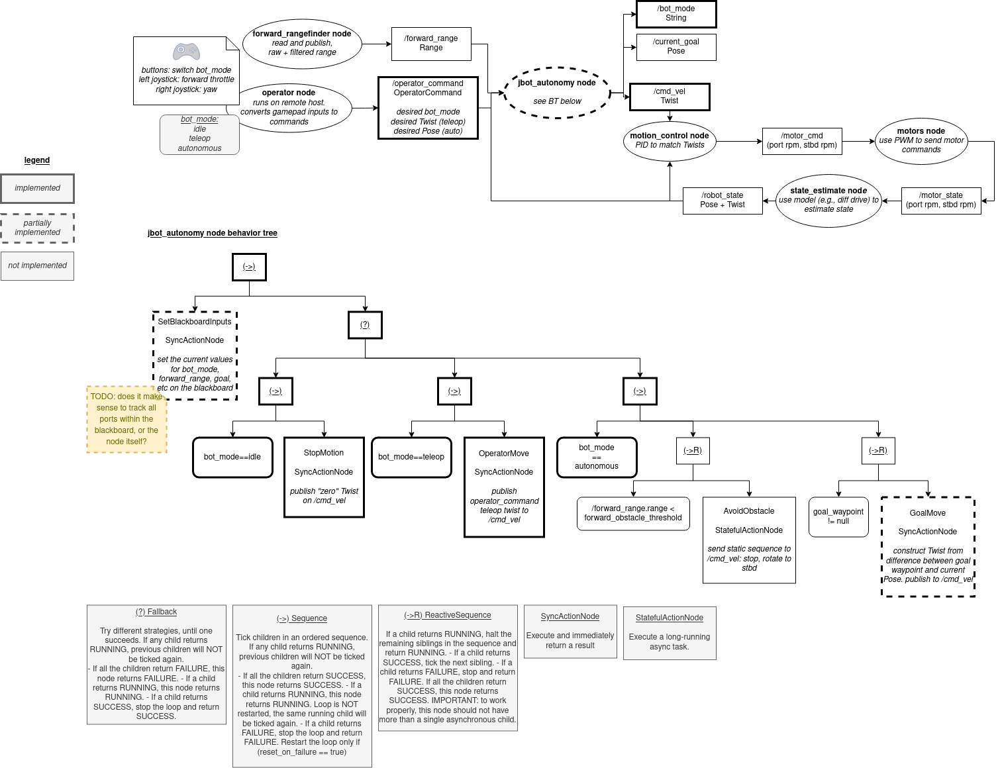

# jbot ROS stack

_Currently a work in progress_

## Architecture



## Development

Setup:

1. Install ROS2 Foxy: https://docs.ros.org/en/foxy/Installation/Ubuntu-Install-Debians.html
   * `sudo apt install ros-foxy-ros-base ros-dev-tools`
1. Install BehaviorTreeCpp v3 (for jbot_autonomy):
   * `sudo apt install ros-foxy-behaviortree-cpp-v3`
1. Install WiringPi (for jbot_drivers):
   * `sudo apt install libwiringpi-dev wiringpi`
Build:

```
source /opt/ros/foxy/setup.bash
colcon build
source ./install/setup.bash
```

Run with:

```bash
ros2 launch jbot_autonomy jbot_autonomy_launch.py 
```
